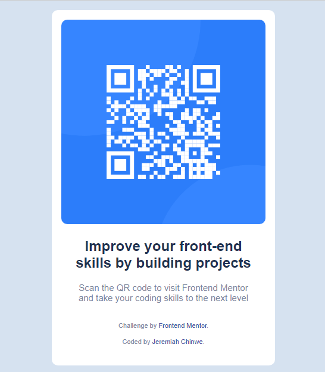

# Frontend Mentor - QR code component solution

This is a solution to the [QR code component challenge on Frontend Mentor](https://www.frontendmentor.io/challenges/qr-code-component-iux_sIO_H). Frontend Mentor challenges help you improve your coding skills by building realistic projects. 

## Table of contents

- [Overview](#overview)
  - [Screenshot](#screenshot)
  - [Links](#links)
- [My process](#my-process)
  - [Built with](#built-with)
  - [What I learned](#what-i-learned)
  - [Continued development](#continued-development)
- [Author](#author)


## Overview

This is my first project/challenge at frontend mentor and it has been an adventure indeed into mastering my front end skills.

### Screenshot

Below is a screenshot of my solution



### Links

- Solution URL: [This is the link to the solution](https://www.frontendmentor.io/challenges/qr-code-component-iux_sIO_H)
- Live Site URL: [This is the link to the live site](https://qr-code-dun-theta.vercel.app/)

## My process

I first viewed the design carefully then wrote the html code for the markup/scetch work. Then I styled it.

### Built with

- Semantic HTML5 markup
- CSS custom properties
- Flexbox
- Mobile-first workflow

### What I learned

Building this project, I learned that when using Flexbox, you can minimize writing lines of media query by using the flex-wrap property which helps wraps the content of your pages according to the width of the device.

```css
.wrap {
  flex-wrap: wrap;
}
```

### Continued development

The area of web developement I want to keep focusing on even in subsequent projects is CSS. I want to master styling web pages with CSS properties that are compatible with all browsers.

## Author

- Frontend Mentor - [@JeremiahChinwe](https://www.frontendmentor.io/profile/JeremiahChinwe)
- Twitter - [@jeremiahchinwe](https://www.twitter.com/jeremiahchinwe)


